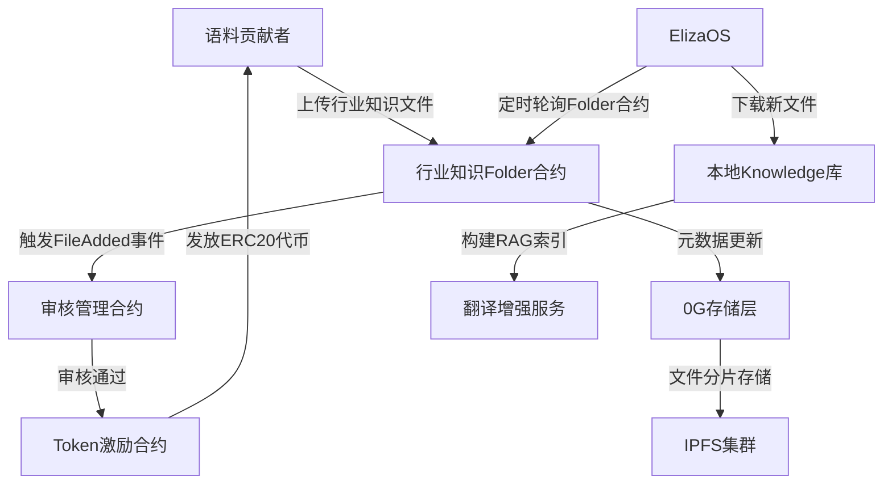

# 去中心化语料众包与翻译增强系统需求文档

版本：MVP 1.0
时间：2025年3月29日

## 零 概述

LinguaBridge是一款结合ElizaOS多智能体框架和0g区块链协议的专业翻译工具，为全球商务人士提供实时翻译、专业文档解读和跨文化交流支持，通过区块链技术确保翻译内容的所有权和价值激励。

基于大模型实现翻译功能，结合evm智能合约，上传语料有token激励，语料会被多人审核。审核通过的语料，用语料微调大模型。可以上传翻译语料, 行业领域知识，还要上传风俗习惯知识，让翻译更接地气。使用RAG技术增强翻译效果。

## 一、系统架构设计

### 1. 核心架构图



### 2. 技术分层

| 层级    | 组件               | 技术方案             | 功能说明               |
| ------- | ------------------ | -------------------- | ---------------------- |
| ​链上层 | 行业知识Folder合约 | Solidity + 0G协议    | 管理文件元数据与版本   |
|         | 审核管理合约       | OpenZeppelin访问控制 | 实现多签审核流程       |
| ​存储层 | 文件分片存储       | 0G存储层+IPFS        | 行业知识文件分布式存储 |
| ​激励层 | Token激励合约      | ERC20标准扩展        | 基于贡献量发放代币     |
| ​应用层 | RAG服务模块        | DeepSeek-API + FAISS | 行业知识检索增强       |
|         | ElizaOS集成        | 定时任务+事件监听    | 知识库动态更新         |

## 二、智能合约设计

### 1. 行业知识Folder合约增强版

```solidity
pragma solidity ^0.8.0;

contract IndustryKnowledgeFolder {
struct FileEntry {
bytes32 hash; 文件内容哈希
uint256 size; 文件大小
address owner; 所有者地址
uint256 timestamp; 创建时间戳
uint8 status; 0-未审核 1-已审核 2-已拒绝
}

mapping(string => FileEntry) public files;
string[] public fileList;
address public admin;

mapping(string => string[]) public categoryFiles;

event FileUploaded(string indexed filename, address uploader);
event FileApproved(string indexed filename, uint256 reward);

constructor() {
admin = msg.sender;
}

function uploadFile(string memory filename, bytes32 hash, uint256 size, string memory category) external {
require(files[filename].timestamp == 0, "File exists");
files[filename] = FileEntry(hash, size, msg.sender, block.timestamp, 0);
fileList.push(filename);
categoryFiles[category].push(filename);
emit FileUploaded(filename, msg.sender);
}

function approveFile(string memory filename, uint256 rewardAmount) external onlyAdmin {
require(files[filename].status == 0, "Invalid status");
files[filename].status = 1;
TokenReward.transfer(files[filename].owner, rewardAmount);
emit FileApproved(filename, rewardAmount);
}
}
```

### 2. 审核管理合约

```solidity
contract ApprovalManager {
using SafeERC20 for IERC20;

address[] public auditors;
mapping(string => uint256) public auditVotes;

function batchApprove(string[] memory filenames, uint256[] memory rewards) external onlyAuditor {
for (uint i=0; i<filenames.length; i++) {
IndustryKnowledgeFolder.approveFile(filenames[i], rewards[i]);
}
}

function verifyAuditorZK(bytes memory proof) external view returns (bool) {
调用zk-SNARK验证电路
}
}
```

## 三、核心业务流程

### 1. 语料贡献与审核流程

#### ​文件上传

- 用户通过客户端上传行业知识文档（PDF/Word/TXT）
- 系统自动计算文件哈希并调用uploadFile()方法
- 文件本体分片存储至0G存储层，元数据记录在链

#### ​多签审核

- 审核委员会成员通过加密通道接收待审文件列表
- 审核者调用batchApprove()进行批量审核
- 获得2/3多数通过的语料触发代币奖励
  ​#### 激励发放

- 审核通过后自动调用ERC20合约的transfer()方法
- 奖励金额公式：基础奖励 + 质量系数 \* 文件大小

### 2. RAG增强流程

sequenceDiagram

```mermaid
participant User
participant ElizaOS
participant Folder合约
participant RAG引擎

User->>ElizaOS: 提交翻译请求
ElizaOS->>Folder合约: 查询最新文件列表
Folder合约-->>ElizaOS: 返回新增文件哈希
ElizaOS->>0G存储层: 下载文件内容
ElizaOS->>RAG引擎: 更新FAISS向量库
RAG引擎->>DeepSeek: 注入行业上下文
DeepSeek-->>User: 返回增强翻译结果
```

## 四、关键创新点

### 1. 动态质量评估机制

​语料价值评估模型
reward_coef = f(文件语义密度, 用户评分, 使用频次)
语义密度通过TF-IDF算法计算

### 2. 抗女巫攻击设计

​贡献者信用体系
credit_score = log(通过审核数) - 0.5\*log(被拒次数+1)
低信用用户需提供零知识证明

### 3. RAG优化方案

| 检索类型   | 权重 | 应用场景     |
| ---------- | ---- | ------------ |
| 语义检索   | 60%  | 专业术语匹配 |
| 关键词检索 | 30%  | 法规条文查找 |
| 时效性检索 | 10%  | 新兴概念识别 |

## 五、MVP阶段实施计划

### 1. 开发里程碑

gantt
title 翻译增强系统开发路线

### section 合约开发

基础合约 :done, 2025-04-01, 7d
审核模块 :active, 2025-04-08, 5d

### section 前端开发

贡献者面板 :2025-04-15, 10d
审核工作台 :2025-04-25, 8d

### section 系统集成

ElizaOS对接 :2025-05-01, 14d
压力测试 :2025-05-15, 7d

### 2. 性能指标

| 指标           | 目标值 | 测量方法     |
| -------------- | ------ | ------------ |
| 文件上传延迟   | <2s    | 压力测试工具 |
| 审核事务TPS    | ≥50    | 区块链浏览器 |
| RAG检索精度    | >92%   | BLEU评分     |
| 代币发放成功率 | 99.99% | 合约事件监控 |

## 六、扩展性设计

### ​多语种支持

- 支持通过category字段区分不同语言区域的民俗知识

### ​DAO治理升级

- 审核委员会选举
- 奖励系数投票
- 语料淘汰机制
